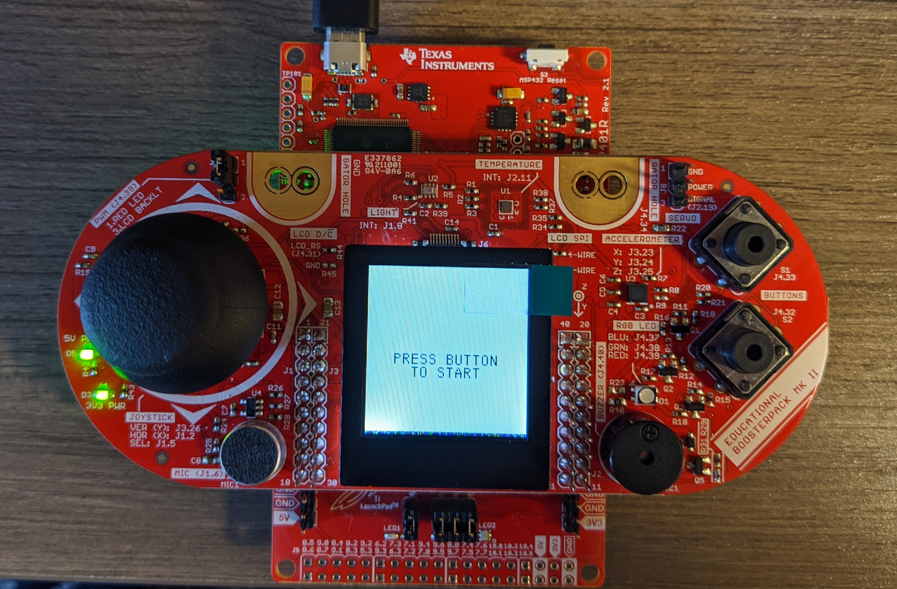
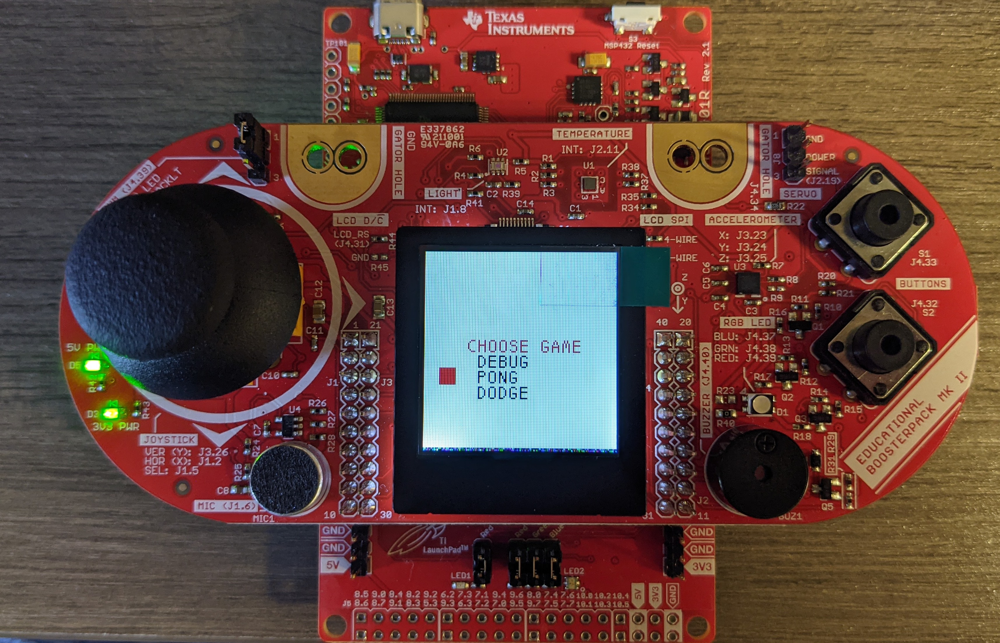
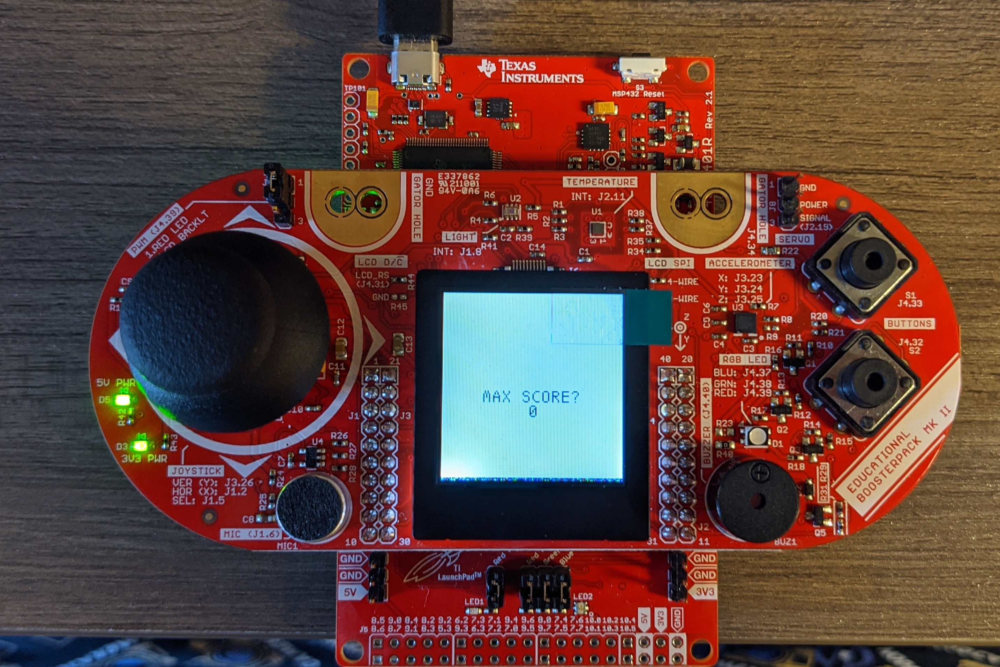
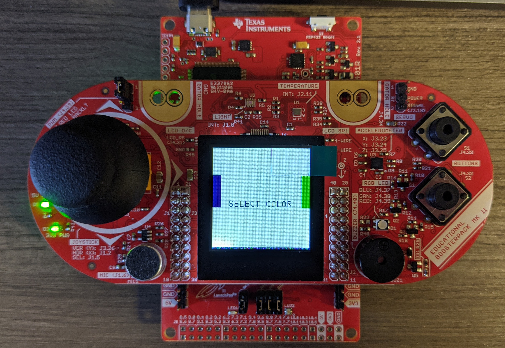

# Handheld video game system

#### Things required :
* 1 TI MSP-EXP432P401R Microcontroller
* 1 Educational BoosterPack MKII
* 1 USB 2.0 A to Micro B Cable
* Code Composer Studio running on either Windows or Mac
---

#### How to build and run the game
1. Clone this repository into your current workspace
2. Open Code Composer Studio with your current workspace as your path
3. Go to File>Open project from file system
4. Add the github repo directory in the import field
5. Code Composer Studio will recognize the project and add it to the workspace.
6. Build the project and start debugging to flash the game onto the MSP432 MCU.
___

#### Motivation :
In order to understand how Embedded systems work, this project was taken up.
Furthermore learning video game development by writing replicas of old legacy games help us understand how a computer generates graphics and processes information even with constrained resources.

---

#### Console Menu System

This particular handheld video game console has 4 different menu screens and the main game window.

1. Start window

2. Choose game

3. Max score

4. Select Color

___

#### Gameplay

___

#### Project Structure

This project consists of 5 different .c files which are as follows :
* adc.h & adc.c are used to configure the left joystick to capture the analog data in the x & y direction
* game.h & game.c contains the main game logic
* main.c is used to call the initialization of ADC, clocks, SPI, LCD & buttons. Furthermore an infinite while loop is used to call the functions in game.c which renders the single player game.

*This is a single player Pong replica in which the second player is controlled by the Microcontroller*

___

#### Future Work
* Implement multithreading using RTOS
* Improve AI logic and make the game faster
---
#### References :
1. Forked from [Git Repo](https://github.com/obergog/MSP432_Game_System)
2. Pong replica in C++ from this [Youtube Tutorial](https://youtube.com/playlist?list=PL7Ej6SUky135IAAR3PFCFyiVwanauRqj3)
3. MSP432 Technical Reference Manual
4. BoosterPack user guide